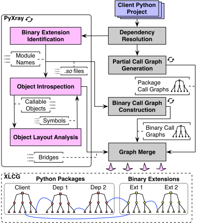

<!-- Badges -->
[](https://doi.org/10.1145/3744916.3764555)
[](https://doi.org/10.5281/zenodo.18009456)
[](https://www.gnu.org/licenses/agpl-3.0)
[](https://hub.docker.com/r/grgalex/pyxray)

> 🚧 **Note:** An update including a refactoring of the codebase and extended instructions on standalone usage is coming soon.

# PyXray: Practical Python Cross-Language Call Graphs

PyXray is a hybrid (static/dynamic) analysis tool that constructs cross-language call graphs of Python packages.

PyXray combines dependency resolution,
bridge recovery,
and graph stitching to produce
a unified cross-language call graph (XLCG) used for downstream analyses (e.g., reachability and bloat).

### Use Cases

- Analyze supply-chain CVE reachability across Python and native code
- Audit Python packages with native extensions
- Quantify dependency bloat for a given client package

# Table of Contents

- [Overview](#overview)
- [Requirements](#requirements)
- [Setup (Standalone usage only)](#setup-standalone-usage-only)
- [Setup (Full reproduction)](#setup-full-reproduction)
- [Reproduce the Core Findings of our Paper](#reproduce-the-core-findings-of-our-paper)
  * [RQ1: Bridge-Finding Results](#rq1-bridge-finding-results)
  * [RQ3: Reachability Analysis for Native Extension CVEs](#rq3-reachability-analysis-for-native-extension-cves)
  * [RQ4: Quantify Bloated Dependency Code](#rq4-quantify-bloated-dependency-code)
- [Use PyXray as a Standalone Tool](#use-pyxray-as-a-standalone-tool)
  * [Find bridges for PyPI packages with native extensions](#find-bridges-for-pypi-packages-with-native-extensions)
  * [Calculate the Cross-Language Call Graph (XLCG) for a given application](#calculate-the-cross-language-call-graph-xlcg-for-a-given-application)
- [Related Publications](#related-publications)

# Overview
PyXray:

1. Resolves the dependencies of a target package
2. Detects Python–native call bridges by analyzing the live object layout of callable Python objects
3. Generates static Python call graphs (via PyCG) and native binary call graphs (via Ghidra)
4. Stitches Python and binary graphs using the identified bridges
5. Produces unified cross-language call graphs (XLCGs) for the target package and all of its dependencies

Bridges and call graphs are cached per package version and reused across analyses, significantly reducing the cost of computing XLCGs as the cache grows.

**Architecture overview.** PyXray combines dependency resolution,
bridge recovery,
and graph stitching to produce
a unified cross-language call graph (XLCG) used for downstream analyses (e.g., reachability and bloat).

<p align="center">
  
</p>

It accompanies the ICSE'26 paper titled "PyXray: Practical Cross-Language Call Graph Construction through Object Layout Analysis".
The paper can be found online at: https://doi.org/10.1145/3744916.3764555, as well as at `pyxray-icse26.pdf` in the root of this repository.

An archived version of the artifact is available on Zenodo at https://doi.org/10.5281/zenodo.18009456.
It also includes a pre-built Docker image (`docker-image.zip`), as well as 
precomputed call graph data (`callgraphs.zip`).

The artifact contains instructions and scripts to re-run the evaluation described in our paper,
as well as use PyXray as a standalone tool to generate cross-language call graphs,
and investigate inter-package/cross-language vulnerability propagation.

The artifact has the following structure:
* `scripts/`: This directory contains the scripts implementing the core functionality of PyXray, including bridge generation and XLCG construction.
* `data/`: This directory holds the data produced by PyXray during execution. It is initially empty.
* `image-build/`: This directory holds components needed to build the PyXray Docker image. This includes the Dockerfile, as well as software needed to generate Python (`PyCG`) and binary call graphs.
* `RQ1/`: This directory holds scripts needed to reproduce our results w.r.t. bridge-finding.
* `RQ3/`: This directory holds scripts needed to reproduce our results w.r.t. reachability analysis of vulnerabilities in native components of polyglot packages.
* `RQ4/`: This directory holds scripts needed to reproduce our results w.r.t. the prevalence of bloat in dependency code of Python client packages.
* `docker-image.zip`: Compressed prebuilt Docker image.
* `callgraphs.zip`: Precomputed call graphs.

# Requirements
1. Docker (Installation Instructions: https://docs.docker.com/engine/install/)
2. Sufficient disk space: ~30 GB.

# Setup (Standalone usage only)

#### 1. Clone PyXray's repository:
```
git clone https://github.com/grgalex/pyxray.git
```

#### 2. Enter the root of the repository:
```
cd pyxray
```

#### 3. Obtain the Docker image (build or pull):

**Option A (recommended): Pull the prebuilt image**
```
sudo docker pull docker.io/grgalex/pyxray:v1
```

**Option B: Build the image locally**
> If you build the image locally, adapt the command in step (4) to use the `pyxray:v1` image.
```
sudo docker build -t pyxray:v1 image-build-standalone/
```

#### 4. Start a container that has PyXray and its dependencies installed:
```
sudo docker run --name pyxray \
	-e GHIDRA_INSTALL_DIR=/ghidra --cap-add=SYS_PTRACE \
	--security-opt seccomp=unconfined -it --rm \
	-v ${PWD?}:/pyxray \
	-w /pyxray \
	grgalex/pyxray:v1
```

# Setup (Full reproduction)
> ⚠️ **Important:** These steps apply only to the **Zenodo artifact** (full reproduction). They assume you have downloaded and extracted the artifact bundle, which includes the prebuilt Docker image and precomputed call graphs. The core directory in the artifact is named `pyxray-eval`.

#### 1. Enter the artifact directory:
```
cd pyxray-eval
```

#### 2a. (Recommended) Extract and load the archived Docker image:
> This will register an image named `pyxray-eval:v1` in your local Docker daemon.
```
unzip -p docker-image.zip | sudo docker load
```

#### 2b. (Optional) Manually build the Docker image:
```
sudo docker build -t pyxray-eval:v1 image-build/
```

#### 3. Extract the precomputed call graphs for the dataset

Computing XLCGs from scratch for all packages studied in the paper is time consuming. The full pipeline includes:

- Python call graph construction  
- Binary call graph extraction using Ghidra  
- Python–native bridge computation  
- Cross-language graph stitching  

End-to-end computation for our dataset of approximately 1,000 packages takes over 48 hours. The dominant cost is binary call graph extraction. For large binaries, such as those in `torch`, this step alone can take tens of hours.

Binary call graphs only need to be computed once and can be reused across all packages that depend on the same native library.

To facilitate artifact evaluation, we provide precomputed XLCGs for all ~1,000 client packages. The released zip files also include prebuilt install artifacts for the 10 packages studied in RQ1, avoiding the need to rebuild them from source.

Bridge identification, reachability (call-chain) analysis, and bloat detection are performed live during artifact execution.

The final section of this documentation describes how to use PyXray on arbitrary packages.

```
unzip callgraphs.zip -d data/
```

#### 4. Start a container that has PyXray and its dependencies installed:
> **Note:** Run this from the repository root so `${PWD}` mounts correctly to `/pyxray`.
```
sudo docker run --name pyxray \
	-e GHIDRA_INSTALL_DIR=/ghidra --cap-add=SYS_PTRACE \
	--security-opt seccomp=unconfined -it --rm \
	-v ${PWD?}:/pyxray \
	-w /pyxray \
	pyxray-eval:v1
```

# Reproduce the Core Findings of our Paper
> ⚠️ **Important:** These steps apply only to the **Zenodo artifact** (full reproduction). They assume you have downloaded and extracted the artifact bundle, which includes the prebuilt Docker image and precomputed call graphs. The core directory in the artifact is named `pyxray-eval`. You must be running the `pyxray-eval:v1` container image (from step 4 above).

## RQ1: Bridge-Finding Results

In this section, we use PyXray to identify Python–native bridges for 10 popular Python packages and compare the results against a manually extracted ground truth.
Ground truth files for each package are located in `RQ1/ground_truth`.

### 1. Enter the RQ1 directory:
```
cd /pyxray/RQ1
```

### 2. Generate the bridges for the packages in `rq1.csv`:
> This step takes approximately 15 minutes.
```
python3 /pyxray/scripts/pyxray_bridges.py -i /pyxray/RQ1/rq1.csv
```

### 3. (Optional) Inspect the bridges for a package:
PyXray stores discovered bridges under `/pyxray/data/star_bridges`.
For example, for the PyNaCl package, the bridges are stored at `/pyxray/data/star_bridges/p/pynacl/RQ1/starbridges.json`.

A bridge file contains:

- **objects_examined**: Total Python objects examined.
- **callable_objects**: Python callables found.
- **foreign_callable_objects**: Callables backed by foreign or FFI targets.
- **duration_sec**: Scan time in seconds.
- **count**: Number of detected Python to native bridges.
- **modules**: Modules yielding foreign callables.
  - **path**: Filesystem path of the module.
  - **import_name**: Module import name.
- **jump_libs**: Native libraries that contain at least one bridged symbol.
- **bridges**: Python to native edges.
  - **pyname**: Fully qualified Python name.
  - **cfunc**: Underlying native symbol (function).
  - **library**: Library that provides the symbol.


For example, to inspect the bridges for the `pynacl` package run:
```
vim /pyxray/data/star_bridges/p/pynacl/RQ1/starbridges.json
```

The content will look like:
```
{
  "objects_examined": 161259,
  "callable_objects": 155345,
  "foreign_callable_objects": 3653,
  "duration_sec": 1,
  "count": 214,
  "modules": [
    {
      "path": "/pyxray/data/install/pynacl___RQ1/nacl/_sodium.abi3.so",
      "import_name": "nacl._sodium"
    }
  ],
  "jump_libs": [
    "pynacl___RQ1/nacl/_sodium.abi3.so"
  ],
  "bridges": [
    {
      "pyname": "nacl._sodium.lib.crypto_aead_chacha20poly1305_abytes",
      "cfunc": "_cffi_f_crypto_aead_chacha20poly1305_abytes",
      "library": "pynacl___RQ1/nacl/_sodium.abi3.so"
    },
    {
      "pyname": "nacl._sodium.lib.crypto_aead_chacha20poly1305_decrypt",
      "cfunc": "_cffi_f_crypto_aead_chacha20poly1305_decrypt",
      "library": "pynacl___RQ1/nacl/_sodium.abi3.so"
    },
...
```
### 4. Summarize bridge-finding results for the 10 RQ1 packages:
> This corresponds to Table 2 in our paper.
```
python3 /pyxray/RQ1/rq1_table.py /pyxray/RQ1/rq1.csv
```

The generated table has the following format:
```
Package        | Ground Truth | Found | Time(s) | Objects | Callable | Foreign
---------------+--------------+-------+---------+---------+----------+--------
torch*         | 353          | 7874  | 161     | 27.1M   | 18.2M    | 925.1K
pyaudio        | 47           | 47    | 3       | 443.8K  | 299.3K   | 23.6K
python-ldap    | 28           | 28    | 3       | 470.6K  | 318.8K   | 30.4K
trace-cruncher | 140          | 140   | 10      | 1.6M    | 1.1M     | 72.0K
numpy*         | 421          | 3026  | 102     | 33.8M   | 31.2M    | 2.3M
pyyaml         | 31           | 31    | 2       | 579.4K  | 548.5K   | 16.3K
pynacl         | 214          | 214   | 1       | 160.2K  | 154.3K   | 3.6K
cryptography   | 715          | 715   | 3       | 634.2K  | 436.8K   | 26.7K
pandas*        | 146          | 5258  | 832     | 71.5M   | 49.2M    | 3.1M
grpcio         | 241          | 241   | 8       | 884.5K  | 826.8K   | 23.8K
```

The comparison with FROG (RQ2) is reported in the paper, as FROG’s source code is not available for independent reproduction.

## RQ3: Reachability Analysis for Native Extension CVEs

To perform cross-language reachability analysis for known CVEs, we:

1. Collect the vulnerable package, function(s), and affected version ranges for each CVE.
2. For each of the ~1,000 client packages, resolve dependencies and identify those that depend on a vulnerable package version.
3. Compute XLCGs for each client package.
4. Perform reachability analysis on the XLCGs to determine which client packages
   (a) depend on a vulnerable package version and
   (b) reach the vulnerable function via a call chain.

The set of analyzed packages is listed in `/pyxray/packages_final.csv`.

### 1. Enter the RQ3 directory:
```
cd /pyxray/RQ3
```

### 2. Inspect the CVE information files:
The `RQ3/cve` directory contains data for the 35 CVEs studied in the paper.
For each CVE, the following information is provided:

1. Package name
2. Vulnerable function name(s)
3. Vulnerable version ranges

For example, `CVE-2024-28219-digest.json` which corresponds to a Pillow CVE has the following info:
```
[
  {
    "cve_id": "CVE-2024-28219",
    "package": "Pillow",
    "analysis": [
      {
        "vulnerable_symbols": [
          "cms_transform_new",
          "buildTransform",
          "buildProofTransform"
        ]
      }
    ],
    "vulnerable_versions": [
      "1.0",
      "1.1",
      "1.2",
...
      "10.0.0",
      "10.0.1",
      "10.1.0",
      "10.2.0"
    ]
  }
]
```

### 3. Perform reachability analysis for the ~1K packages and 35 CVEs:
> This step takes approximately 30 minutes.
> At completion, it prints a table corresponding to Table 3 in the paper.

```
bash rq3.sh
```

The resulting table will look like:
```
CVE            | Package | Vuln. symbol        | Bridges | Bridges   | Clients  | Clients
               |         |                     | (Total) | (% vuln.) | (Depend) | (Call)
---------------+---------+---------------------+-----------------+------------------+-------
CVE-2020-10177 | pillow  | ImagingFliDecode    | 233     | 0.44      | 29       | 0
CVE-2020-35654 | pillow  | _decodeStrip        | 233     | 0.44      | 29       | 0
CVE-2020-5311  | pillow  | expandrow           | 233     | 0.44      | 29       | 0
CVE-2021-34141 | numpy   | _convert_from_str   | 3026    | 20.81     | 201      | 185
CVE-2021-25290 | pillow  | _tiffReadProc       | 233     | 0.88      | 29       | 0
CVE-2022-30595 | pillow  | ImagingTgaRleDecode | 233     | 0.44      | 37       | 0
CVE-2023-25399 | scipy   | Py_FindObjects      | 1203    | 0.03      | 121      | 4
CVE-2024-28219 | pillow  | cms_transform_new   | 233     | 0.44      | 46       | 3
```


The difference in the number of vulnerable clients for `CVE-2024-28219` (3 here vs. 4 in the paper) is due to the final dataset using `psd-tools==1.10.6`, which already includes the fix applied after we notified the maintainers. See: https://github.com/psd-tools/psd-tools/issues/460.

The file `vuln_clients.json` contains detailed reachability results, including:

- Call chains to the vulnerable function for each vulnerable client
- The number of call chains reaching the vulnerable symbol from any function in the dependent package
- The centrality of the vulnerable symbol with respect to the dependent package’s public Python API: the percentage of defined Python functions in the dependent package that ultimately reach the vulnerable native symbol

As an example, for `CVE-2024-28219`, the corresponding entry in `vuln_clients.json` is:
```
  {
    "id": "CVE-2024-28219",
    "stats": {
      "package": "pillow",
      "vuln_symbols": [
        "cms_transform_new",
        "buildTransform",
        "buildProofTransform"
      ],
      "vuln_versions": [
      ...
      ],
      "max_vuln_version": "10.2.0",
      "latest_version": "12.0.0",
      "found_in_sbs_max_vuln": []
    },
    "transitively_vulnerable_packages": [
      "ginga:5.2.0",
      "large-image:1.31.1",
      "thumbor:7.7.4"
    ],
    "num_vuln": 3,
    "num_rdeps": 46,
    "sample_chains": {
      "large-image:1.31.1": {
        "buildTransform": [                                                                                                                                   
          "large_image.tilesource.base.TileSource._outputTile",                                                                                               
          "large_image.tilesource.base.TileSource._outputTileNumpyStyle",                                                                                     
          "large_image.tilesource.base.TileSource._applyStyle",                                                                                               
          "large_image.tilesource.base.TileSource._applyICCProfile",                                                                                          
          "PIL.ImageCms.buildTransform",                                                                                                                      
          "PIL.ImageCms.ImageCmsTransform.__init__",                                                                                                          
          "PIL._imagingcms.buildTransform",                                                                                                                   
          "buildTransform"                                                                                                                                    
        ],                                                                                                                                                    
...
    "num_chains_per_rdep": {
      "large-image:1.31.1": 2,
      "ginga:5.2.0": 10,
      "thumbor:7.7.4": 3
    },
    "centrality_per_rdep": {
      "large-image:1.31.1": 0.0049504950495049506,
      "ginga:5.2.0": 0.0008361204013377926,
      "thumbor:7.7.4": 0.0020242914979757085
    }
...
```

## RQ4: Quantify Bloated Dependency Code

In this section, we use PyXray to quantify unused dependency code in dependency packages (both pure Python and polyglot).

We generate XLCGs for the ~1,000 client packages in our dataset and use reachability information to classify modules/binaries and functions (Python/native) as used or unused (bloat).

### 1. Enter the RQ4 directory:
```
cd /pyxray/RQ4
```

### 2. Calculate the Prevalance of Dependency Bloat:

To quantify dependency bloat, we:

1. Compute the XLCG for each client package (including all dependencies).
2. Determine reachability for each Python module/function and binary module/function.
3. Aggregate per-client averages and histograms (stored under `histograms/`).

```
bash rq4.sh
```

The resulting table corresponds to Table 4 in the paper and will look like:

```
Feature                             | 5%           | Mean         | Median       | 95%
------------------------------------+--------------+--------------+--------------+-------------
python_size                         |      0.83 MB |     19.93 MB |      8.83 MB |     73.41 MB
bloated_dependency_percent          |      0.00 %  |     48.98 %  |     50.00 %  |     86.67 %
python_file_bloat_percent           |     71.74 %  |     87.54 %  |     89.38 %  |     98.38 %
python_function_bloat_percent       |     88.22 %  |     95.52 %  |     96.28 %  |     99.58 %
bin_size                            |      0.20 MB |     53.12 MB |     12.66 MB |    193.57 MB
bloat_whole_bin_percent             |      7.77 %  |     66.73 %  |     67.71 %  |    100.00 %
bloat_symbols_percent               |     60.21 %  |     92.00 %  |    100.00 %  |    100.00 %
total_size                          |      1.38 MB |     74.87 MB |     21.70 MB |    261.65 MB
total_file_bloat                    |     29.68 %  |     70.09 %  |     73.29 %  |     98.89 %
total_function_bloat                |     70.40 %  |     90.30 %  |     92.97 %  |     99.72 %
```

# Use PyXray as a Standalone Tool
> The instructions below work with any of the `pyxray` and `pyxray-eval` Docker images.

## Find bridges for PyPI packages with native extensions
> There is no need for a-priori knowledge that a Python package contains native extensions.
> If the package has no native extensions, PyXray will simply output zero bridges.

### 1. Create a file with the packages/versions you want to analyze:
> Each line contains a single `package:version` combination.

For example, to target the latest versions of `charset_normalizer` and `pillow`, run the following command to create the file:
```
cat <<EOF > /pyxray/scripts/test.csv
charset-normalizer:3.4.4
pillow:12.0.0
EOF
```

### 2. Identify cross-language bridges using PyXray:
```
python3 /pyxray/scripts/pyxray_bridges.py -i /pyxray/scripts/test.csv
```


This scans each package, imports its modules, and inspects callable objects at runtime to detect Python–native call bridges. Results are written as JSON under `pyxray/data/star_bridges/`, organized by package name and version.

For example, the bridges for `charset-normalizer:3.4.4` are stored at:
`/pyxray/data/star_bridges/c/charset-normalizer/3.4.4/starbridges.json`

To view the bridges:
```
less /pyxray/data/star_bridges/c/charset-normalizer/3.4.4/starbridges.json
```

## Construct the Cross-Language Call Graph (XLCG) for a given application

### 1. Create a file with the packages/versions you want to analyze:
> Each line contains a single `package:version` combination.

For example, to target version 7.7.4 of `thumbor`, run the following command to create the file:
```
cat <<EOF > /pyxray/scripts/test.csv
thumbor:7.7.4
EOF
```

### 2. Generate the Cross-Language call graphs (XLCGs) of the packages (this also performs reachability analysis):
> It is normal for binary call graph generation of large binaries to take a significant amount of time.
> Ensure your working directory is `/pyxray/scripts/` when invoking the XLCG script.
```
cd /pyxray/scripts && bash xlcg.sh test.csv
```

`xlcg.sh` abstracts away the underlying phases of XLCG construction:

```
$ cat /pyxray/scripts/xlcg.sh
...
python3 dep_and_partial.py -i "$PACKAGES_CSV" && \ # Dependency resolution + Python call graph construction
python3 pypi_unistitch.py -i "$PACKAGES_CSV" && \ # Bridge identification + Binary call graph construction + stitching
python3 reachability.py -P # Reachability analysis (DFS) from the target package's Python functions on the XLCG
```

PyXray automatically infers the dependencies of each package, and generates the Python and binary call graphs as well as their Python-Native bridges as needed.
We store XLCGs under `/pyxray/data/unified_cg`.
We store post-reachability-analysis (keeping only nodes reachable from any of the client package's Python functions) XLCGs (a.k.a. "reached XLCGs") under `/pyxray/data/reached_cg`.

### 3. Check if a client is transitively affected by a CVE from a dependency package:

Example:
CVE-2024-28219 (part of our dataset) affects symbol `buildTransform` for Pillow versions < 10.3.0.

If `buildTransform` exists in the reached XLCG of a client package, it means that package is transitively affected by the CVE.

For example, to check if `thumbor:7.7.4` is affected by the CVE, we grep its reached XLCG for the vulnerable symbol.

```
grep -r buildTransform /pyxray/data/reached_cg/pypi/t/thumbor/7.7.4/reached.json
```

### 4. Find cross-language call chains reaching the vulnerable function
> Continuing the example from (3): `thumbor` and `CVE-2024-28219`.

Given a target function and a reached XLCG, PyXray can compute all cross-language call chains that reach the vulnerable function.

```
python3 call_chain.py \
-i /pyxray/data/reached_cg/pypi/t/thumbor/7.7.4/reached.json \
-s buildTransform
```

This produces the following call chain:
```
  [
    "thumbor.engines.pil.Engine.read",
    "thumbor.utils.ensure_srgb",
    "PIL.ImageCms.ImageCmsTransform.__init__",
    "PIL._imagingcms.buildTransform",
    "buildTransform"
  ]
```

## License

Copyright (C) 2026 Georgios Alexopoulos

This project is licensed under the GNU Affero General Public License v3.0 (AGPLv3).
See the LICENSE file for details.

## Related Publications

* Georgios Alexopoulos, Thodoris Sotiropoulos, Georgios Gousios, Zhendong Su, and Dimitris Mitropoulos.
[PyXray: Practical Cross-Language Call Graph Construction through Object Layout Analysis](https://grgalex.gr/assets/pdf/pyxray_icse26.pdf).
In Proceedings of the 48th International Conference on Software Engineering (ICSE '26), April 2026
